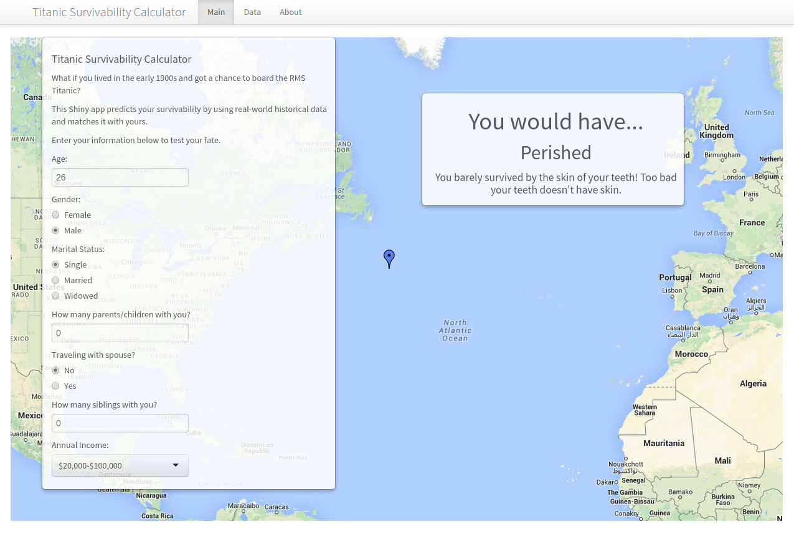

## Motivation

* Inspired by the Kaggle competition [Titanic: Machine Learning from Disaster](https://www.kaggle.com/c/titanic-gettingStarted)
* One of the first major industrial disasters that could have been avoided
* Concept could be used for other future accidents
* Fascination on the subject has not died down even after 100 years
* (I mean, who wouldn't want mathematical proof why Jack died and Rose lived, right?)

--- &radio

## Pop Quiz!

From which port did the RMS Titanic set sail from?

1. New York City
2. New Jersey
3. _Southampton_
4. Liverpool

*** .hint
It's not in Newfoundland, guvnah.
*** .explanation
The RMS Titanic traveled from Southampton to New York City on April 10, 1912.

---

## Implementation

* The algorithm used for prediction was the Random Forest Algorithm
* A detailed write-up could be found [here](analysis.pdf)
* To replicate on local machine, download the entire repo and run the following code:


```r
library(shiny)
runApp()
```

* If you prefer to run it online, click on this [link to access the Shiny App server](https://jedau.shinyapps.io/DevDataProd007-Proj/).

---



---

## References

* [RMS Titanic Wikipedia page](http://en.wikipedia.org/wiki/RMS_Titanic)
* [Kaggle](https://www.kaggle.com/)

