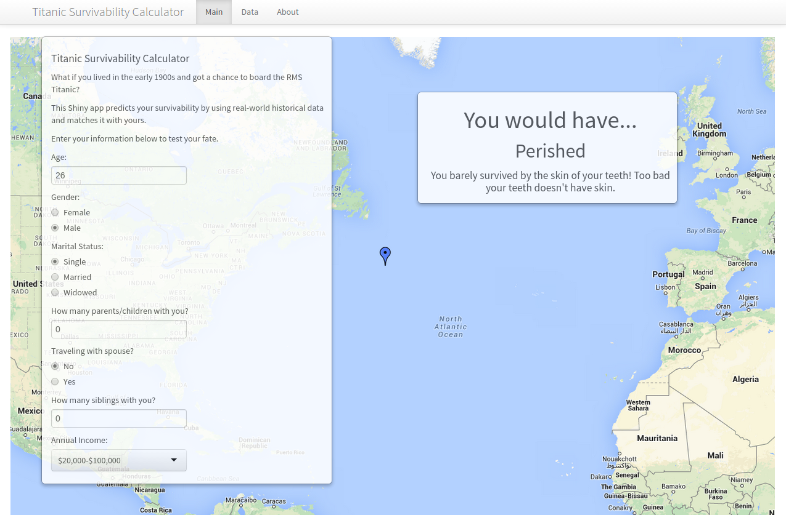

Titanic Survivability Calculator
========================================================
author: Jed Aureus Gonzales
date: 


Motivation
========================================================

- Inspired by the Kaggle competition [Titanic: Machine Learning from Disaster](https://www.kaggle.com/c/titanic-gettingStarted)
- One of the first major industrial disasters that could have been avoided
- Concept could be used for other future accidents
- Fascination on the subject has not died down even after 100 years
- (I mean, who wouldn't want mathematical proof why Jack died and Rose lived, right?)

A Bit of History
========================================================

- The RMS Titanic traveled from Southampton to New York City on April 10, 1912
- *Titanic's* passengers numbered around 1,317 people: 324 in First Class, 284 in Second Class. and 709 in Third Class. Of these, 869 (66%) were male and 447 (34%) female. There were 107 children aboard, the largest number of which were in Third Class.

Implementation
========================================================

- The algorithm used for prediction was the Random Forest Algorithm
- A detailed write-up could be found [here](analysis.pdf)
- To replicate on local machine, download the entire repo and run the following code:

```r
library(shiny)
runApp()
```

* If you prefer to run it online, click on this [link to access the Shiny App server](https://jedau.shinyapps.io/DevDataProd007-Proj/).


========================================================



References
========================================================

* [RMS Titanic Wikipedia page](http://en.wikipedia.org/wiki/RMS_Titanic)
* [Kaggle](https://www.kaggle.com/)
